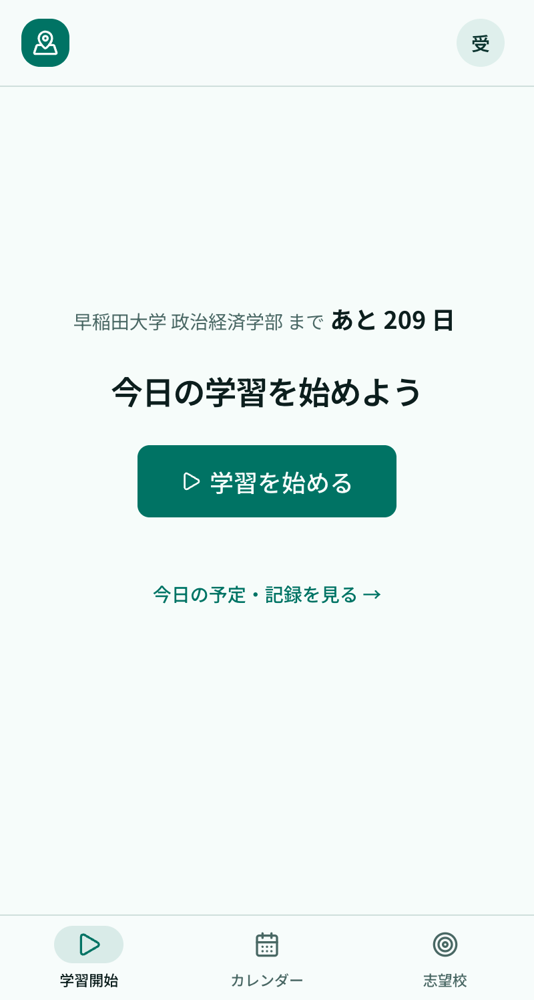
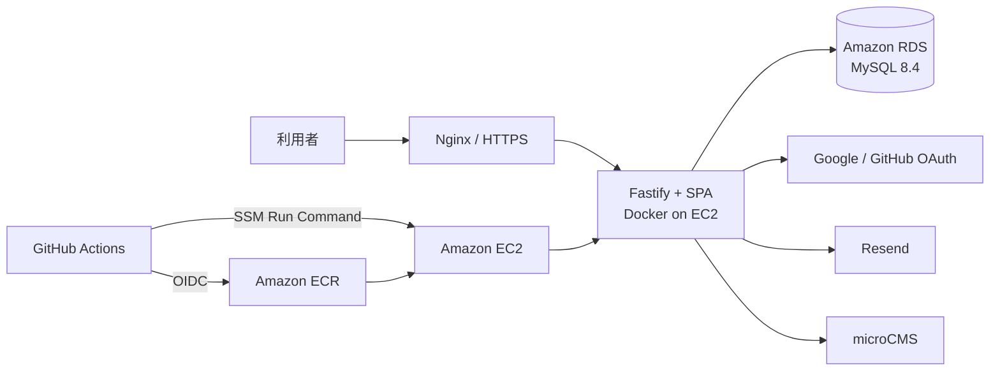

# 受験マップ

大学受験生が、毎日の学習を簡単に記録し、予定・実績・志望校まで一か所で振り返れるWebアプリです。

「記録を続けるために入力の手間を減らすこと」を中心に、学習タイマー、クイック記録、カレンダーによる可視化を実装しています。全国の大学・学部マスターを使った志望校管理や、受験日程の確認にも対応しています。

[本番環境を開く](https://juken-map.com)（AWS EC2上でセルフホスト）

## デモ

登録せずに、志望校や学習予定が入った状態を試せます。

1. [ログイン画面](https://juken-map.com/login)を開きます。
2. 「デモでログイン」を選択します。
3. 学習記録、カレンダー、志望校管理などを確認します。

デモユーザーは読み取り専用です。編集操作はサーバー側でも制限しています。

手動でログインする場合は、次のテストアカウントを使用できます。

- メールアドレス: `demo@juken-map.com`
- パスワード: `demodemo1234`

## 画面



## 主な機能

### 学習を記録する

- **学習タイマー** — 今日の予定や「その他の学習」から内容を選び、タイマーを開始できます。終了後は内容と時間を確認して、そのまま実績として保存できます。
- **クイック記録** — タイマーを使わなかった学習も、日付と時間を選んで後から追加できます。
- **学習実績の編集** — 日付、時間、科目、教材、範囲、メモを後から修正できます。
- **学習予定** — 日ごとの予定に科目、参考書、学習範囲を設定できます。ドラッグによる日付変更や完了操作にも対応しています。

### 学習を振り返る

- **学習カレンダー** — 予定と実績を同じ月間カレンダーに表示します。日ごとの学習時間を色の濃淡で、科目の内訳をバーで確認できます。
- **学習状況の可視化** — 継続日数、直近7日間の科目別学習時間、当日の進捗を表示します。
- **逆算ナビ** — 参考書の総量、目標日、到達位置から、今日取り組む範囲の目安を提示します。

### 志望校と受験日程を管理する

- **大学を探す** — 全国823大学のマスターから、大学名、都道府県、設置区分で絞り込めます。
- **志望校管理** — 気になる大学を候補として保存し、受験校へ確定できます。第一志望と併願校も分けて管理できます。
- **受験日程** — 登録した志望校の受験日をタイムラインやカレンダーで確認できます。

### その他

- **認証** — Google、GitHub、メールアドレスとパスワードに対応しています。メール確認とパスワード再設定にはResendを使用しています。
- **PWA** — スマートフォンのホーム画面やMacのDockへ追加し、単独のアプリとして起動できます。
- **ブログ** — microCMSで管理する記事を一覧・詳細ページに表示します。

## 設計上の工夫

- **入力から振り返りまでをつなぐ設計** — 学習の開始、実績保存、カレンダーへの反映を一連の流れとして扱い、記録の手間を抑えています。
- **サーバー状態の一元管理** — TanStack Queryを使い、志望校、学習予定、実績、参考書の取得・更新とキャッシュを管理しています。
- **バリデーションの一元化** — `lib/validations/` のZodスキーマをクライアントとAPIで共有しています。フロント、API、データベースの各層で不正な入力や重複を防ぎます。
- **デモ環境の保護** — UIだけに依存せず、更新APIにも読み取り専用ガードを適用しています。
- **Infrastructure as Code** — VPC、EC2、RDS、セキュリティグループ、ECR、IAMをTerraformで管理しています。
- **自動テストとデプロイ** — Vitest、Playwright、GitHub Actionsを使い、検査からAWSへのデプロイまでを自動化しています。

## アーキテクチャ



本番では、GitHub ActionsがDockerイメージをECRへpushします。デプロイ処理はSSM Run CommandでEC2上に実行し、EC2のIAMインスタンスロールを使ってイメージをpullします。SSHの22番ポートは公開していません。

本番のLINE API秘密情報はAWS Secrets Managerの`juken-map/production/runtime`で管理します。デプロイスクリプトがEC2のIAMインスタンスロールで取得し、コンテナ起動時だけ一時的な環境変数ファイルとして渡します。秘密値はTerraform stateやGitHub Actionsへ保存しません。

## テックスタック

| カテゴリ | 技術 |
|---|---|
| フロントエンド | React 19 / Vite（SPA） |
| バックエンド | Fastify 5（Node.js 24） |
| 言語 | TypeScript |
| UI | shadcn/ui / Tailwind CSS v4 / Motion |
| フォーム・検証 | React Hook Form / Zod |
| サーバー状態 | TanStack Query |
| カレンダー | FullCalendar / Schedule-X |
| ORM・DB | Prisma 7 / MySQL 8.4 |
| 認証 | Better Auth |
| メール | Resend |
| CMS | microCMS |
| テスト | Vitest / Playwright |
| コンテナ | Docker / Docker Compose |
| インフラ | AWS EC2 / RDS / ECR / Nginx / Systems Manager |
| IaC | Terraform |
| CI/CD | GitHub Actions / AWS OIDC |

## データソース

全国大学マスターには、[ASTI アマノ技研「国内大学の位置データ」](https://amano-tec.com/)を利用しています。国立・公立・私立の823校を取り込み、住所から都道府県と設置区分を整形しています。

変換処理は `scripts/transform-universities.ts`、整形済みデータは `data/clean/universities.json` にあります。

## ローカルセットアップ

### 前提条件

- Node.js 24
- pnpm 12.3.4（`package.json`で固定）
- Docker Desktopなど、Docker Composeを実行できる環境

OAuthログイン、メール送信、ブログまで確認する場合は、Google・GitHub OAuth、Resend、microCMSの資格情報も必要です。

### 初回起動

1. リポジトリをクローンします。

   ```bash
   git clone https://github.com/shimaiku1960/juken-map.git
   cd juken-map
   ```

2. 依存関係をインストールします。

   ```bash
   npm install --global pnpm@12.3.4
   pnpm install --frozen-lockfile
   pnpm run hooks:install
   ```

   `hooks:install`は、依存ファイルを含むpushの前だけLinux環境でlockfileを確認するGitフックを有効にします。

3. 環境変数ファイルを作成します。

   ```bash
   cp .env.example .env
   ```

4. `.env` の各値を開発環境に合わせて変更します。

   [注意] `.env` には秘密情報が含まれます。Gitへコミットしないでください。

5. MySQLを起動します。

   ```bash
   pnpm run dev:infra
   ```

6. Prisma Clientを生成し、マイグレーションを適用します。

   ```bash
   pnpm exec prisma generate
   pnpm exec prisma migrate deploy
   ```

7. 大学マスターとデモデータを投入します。

   ```bash
   pnpm exec prisma db seed
   ```

8. 開発サーバーを起動します。MySQLの起動とマイグレーション確認後、APIと画面が並列で起動します。

   ```bash
   pnpm dev
   ```

   APIと画面のログは、実行したターミナルに実行元の名前付きで表示されます。
   Viteが`/api`を4000番へ同一オリジンでプロキシするため、本番（nginxが1オリジンで配る構成）と
   同じ形になります。ブラウザで開くのは5173番です。

9. [http://localhost:5173](http://localhost:5173)を開きます。

### 2回目以降の起動

```bash
pnpm dev
```

`Ctrl+C`でAPIと画面をまとめて停止できます。MySQLコンテナはバックグラウンドで継続するため、停止する場合は`pnpm run dev:infra:stop`を実行します。

[注意] `.env`を変更したら、APIプロセスを再起動してください。`--env-file`は起動時に一度しか
読まれないため、`tsx watch`ではソース変更でしか再読み込みされません。

本番相当のDocker構成を確認する場合は、次のコマンドを使用します。

```bash
docker compose up --build
```

### 完了の確認

次の状態になれば、ローカルセットアップは完了です。

- `http://localhost:5173` でトップページが表示される
- ログイン画面からデモユーザーでログインできる
- ダッシュボードに学習予定や志望校が表示される

## 環境変数

設定項目は [.env.example](.env.example) を参照してください。

| 変数 | 用途 |
|---|---|
| `DATABASE_URL` | MySQLへの接続 |
| `BETTER_AUTH_SECRET` | セッションなどの署名 |
| `BETTER_AUTH_URL` | Better AuthのベースURL |
| `AUTH_GOOGLE_ID` / `AUTH_GOOGLE_SECRET` | Google OAuth |
| `AUTH_GITHUB_ID` / `AUTH_GITHUB_SECRET` | GitHub OAuth |
| `RESEND_API_KEY` | メール確認・パスワード再設定・各種メール通知 |
| `ADMIN_NOTIFICATION_EMAIL` | 新規ユーザー登録の通知先メールアドレス |
| `DAILY_NOTIFICATION_SECRET` | 朝・夜の学習通知APIを保護する秘密値（本番サーバーとGitHub Actionsで同じ値を設定） |
| `LINE_CHANNEL_SECRET` | LINE Messaging APIのWebhook署名検証 |
| `LINE_CHANNEL_ACCESS_TOKEN` | LINE公式アカウントからの通知送信・アカウント連携 |
| `LINE_LOGIN_CHANNEL_ID` | プロフィールから直接LINE連携するLINE LoginチャネルID |
| `LINE_LOGIN_CHANNEL_SECRET` | LINE Loginの認可コード交換 |
| `MICROCMS_API_KEY` / `MICROCMS_SERVICE_DOMAIN` | ブログ記事の取得 |

## 開発コマンド

| コマンド | 説明 |
|---|---|
| `pnpm dev` | MySQLとマイグレーションを準備し、APIとViteを並列で起動する |
| `pnpm run dev:infra` | MySQLコンテナを起動する |
| `pnpm run dev:api` | Fastify（APIとSPA配信）を4000番で起動する |
| `pnpm run dev:web` | Vite（画面）を5173番で起動する |
| `pnpm run dev:infra:stop` | MySQLコンテナを停止する |
| `pnpm run dev:infra:logs` | MySQLコンテナのログを表示する |
| `pnpm run lint` | ESLintを実行する |
| `pnpm run test` | ルート（`src/`）のVitestを実行する |
| `pnpm run e2e` | PlaywrightのE2Eテストを実行する |
| `pnpm run check` | Lint、型チェック、3種のVitest、SPAビルドをまとめて実行する |
| `pnpm run capture:seed` | LP撮影用ユーザーをローカルDBへ投入する |
| `pnpm run hooks:install` | リポジトリ管理のGitフックを有効にする |
| `pnpm run lock:check` | 隔離ディレクトリでmanifestとlockfileの整合性を検証する |
| `pnpm run lock:linux` | DockerのLinux/amd64環境でfrozen installとPrisma・Viteの起動を検証する |
| `pnpm run lock:fix` | lockfileを更新し、Linuxで検証する |

`apps/api`と`apps/web`のテストは、それぞれ`pnpm --filter @juken-map/api test`と
`pnpm --filter @juken-map/web test`で個別に実行できます（`pnpm run check`には含まれます）。

## テストとCI

変更をpushする前に、次のコマンドで主要な検査をまとめて実行できます。

```bash
pnpm run check
```

ルートと`apps/*`はpnpm workspaceです。各アプリの依存はそれぞれの`package.json`に宣言し、解決結果はルートの`pnpm-lock.yaml`で共有します。依存追加は、例えば`pnpm --filter @juken-map/web add パッケージ名`、ルートの開発依存なら`pnpm add -Dw パッケージ名`を使います。

manifest・`pnpm-workspace.yaml`・`pnpm-lock.yaml`を含むpushでは、pre-pushフックが非破壊の`pnpm run lock:check`を実行します。依存変更後は`pnpm install`に続けて`pnpm run lock:linux`でLinux/amd64のインストール成功を確認し、manifestとlockfileを一緒にコミットしてください。CIでも`pnpm install --frozen-lockfile`を使います。

依存パッケージのinstall scriptは`pnpm-workspace.yaml`の`allowBuilds`で必要なものだけ許可しています。新しい依存でビルド未承認のエラーが出た場合は、スクリプトの内容を確認してこの設定を更新します。

GitHub Actionsでは、次の3ジョブを実行します。

- `lockfile` — Linux向けネイティブ依存関係がlockfileに含まれるか確認する
- `check` — Lint、型チェック、Vitest、本番ビルドを実行する
- `e2e` — MySQLサービスコンテナ上でPlaywrightを実行する

## デプロイ

`main` ブランチへのpushを起点に、GitHub Actionsが次の順序で本番へデプロイします。

1. Dockerイメージをビルドします。
2. AWS OIDCで一時的な認証情報を取得します。
3. DockerイメージをAmazon ECRへpushします。
4. SSM Run CommandでEC2上のデプロイスクリプトを実行します。
5. EC2がIAMインスタンスロールでECRからイメージをpullします。
6. マイグレーションとコンテナの入れ替えを実行します。
7. スモークテストに失敗した場合は直前のイメージへ戻します。

デプロイジョブには `concurrency` を設定し、複数のデプロイが同時に本番環境を変更しないようにしています。

## 主なディレクトリ

```text
apps/
├── web/                 # 画面（React + Vite の SPA）
│   ├── src/pages/         ルートに対応する画面
│   ├── src/components/    画面部品（ui/ は shadcn/ui）
│   ├── src/hooks/         TanStack Query のサーバー状態フック
│   └── public/            favicon、PWAアイコン、manifest、robots.txt
└── api/                 # バックエンド一式（Fastify）
    ├── src/routes/        HTTPの入口（認証・検証・ステータスコード）
    ├── src/services/      ユースケース（DBアクセス・業務ルール）
    ├── src/infra/         Prisma、メール、LINE、microCMS
    ├── src/auth.ts        Better Auth の定義
    ├── src/context.ts     認証・デモガードの門番
    └── src/seo.ts         robots / sitemap / ページ別 meta

src/
└── shared/              # 外部依存のない純粋関数・型・Zodスキーマ（両方のアプリから使う）

e2e/                     # Playwright E2Eテスト
infra/nginx/             # 本番リバースプロキシ設定の記録
prisma/                  # スキーマ、マイグレーション、seed
scripts/                 # 補助スクリプト
terraform/               # AWSインフラ定義
```

## 主要なデータモデル

- **User / Account / Session / Verification** — Better Authの認証データ
- **FinalGoal** — 志望校、第一志望、候補・受験校の状態
- **StudyPlan** — 日ごとの学習予定、科目、参考書、学習範囲
- **StudyLog** — 学習時間、到達範囲、メモ
- **Textbook / TextbookMaster** — ユーザーの参考書と参考書マスター
- **University / Faculty / Tag** — 大学、学部、学部系統タグのマスター
